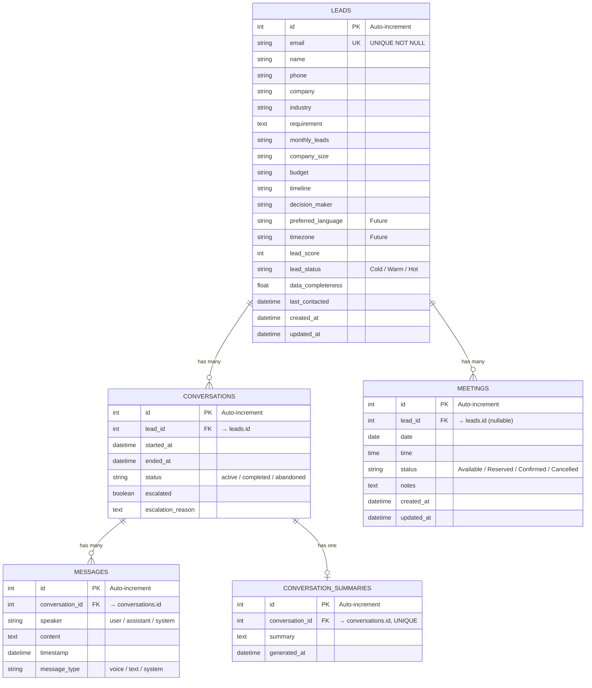
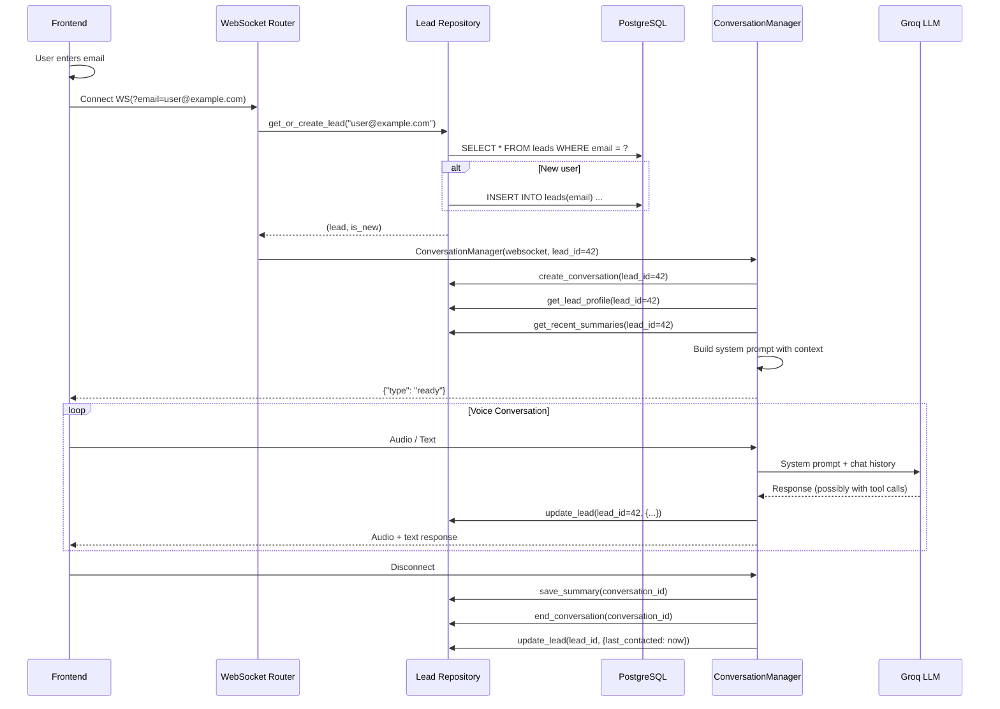

# Revised Architecture: Lead-Centric Identity System

Replace the current UUID-based conversation/visitor identity system with a **lead-centric architecture** where the user's email is the business-facing identifier, but an **integer `lead_id`** is the internal primary key used across all services, repositories, and relationships.

---

## Entity Relationship Diagram



---

## Architectural Decisions & Justifications

### 1. Integer PK with Email as Unique Business Key

| Aspect | Previous Plan (email PK) | Revised (integer PK + unique email) |
|---|---|---|
| **FK efficiency** | String FKs in every child table | Integer FKs — smaller, faster joins |
| **Email changes** | Cascading update across all FKs | Single `UPDATE leads SET email = ...` |
| **Index size** | Variable-length string indexes | Fixed 4-byte integer indexes |
| **Normalization** | Violates 2NF (mutable business data as PK) | Proper surrogate key pattern |

### 2. Lead owns Meetings (not Conversation)

Previously meetings were linked to a conversation (a single session). Now they're linked to the lead — so if a user books a meeting in session 1, then calls back in session 2, the meeting is still visible under their profile. This also means the admin dashboard can show all meetings for a lead in one place.

### 3. Concise Returning-User Context (no prompt bloat)

Instead of injecting all prior messages into the system prompt, we load:
- **Lead profile** (structured fields: name, company, budget, etc.)
- **Recent conversation summaries** (last 3, max ~200 words each)
- **Data completeness** (tells the AI which fields are still missing)

This keeps the prompt under ~500 tokens of context even for returning users, versus potentially thousands of tokens if we injected raw message history.

### 4. Standalone Migration Script (not drop_all in startup)

`drop_all()` inside `lifespan()` is dangerous — one accidental deployment wipes production. Instead, a standalone `migrate_to_lead_schema.py` script handles the one-time migration, and `main.py`'s startup remains safe (`create_all` only creates tables that don't exist).

### Trade-offs

| Trade-off | Impact | Mitigation |
|---|---|---|
| Extra DB round-trip at connection start (`get_or_create_lead`) | ~2-5ms one-time per session | Negligible vs. WebSocket handshake time |
| `lead_score` / `lead_status` removed from `conversations` table | Dashboard can't show per-conversation scores | These live on the lead (accumulated over time), which is more accurate |
| Email is required before conversation starts | Slight friction for users | Better data quality; prevents anonymous junk sessions |

### Existing Functionality Changes

| Feature | Before | After |
|---|---|---|
| Visitor ID | Generated client-side, stored in localStorage | **Removed** — email replaces it |
| Conversation ID | UUID generated client-side, passed via WS query | **Removed** — server-side auto-increment, no client awareness |
| Lead per conversation | Each conversation creates its own lead | **One lead per email** — updated over time |
| Meeting FK | Points to `conversations.id` | Points to `leads.id` |
| Admin dashboard conversation list | Shows UUID-based IDs | Shows integer IDs with email column |

---

## Proposed Changes

### Database Models

---

#### [MODIFY] [lead.py](file:///c:/Projects/Website%20Voice%20Agent/voice-agent/app/models/lead.py)

Remove UUID `id` and `conversation_id` FK. Add integer auto-increment PK. Make `email` a unique, non-nullable business key. Add `last_contacted` field. Add relationships to `conversations` and `meetings`.

```python
class Lead(Base):
    __tablename__ = "leads"

    id = Column(Integer, primary_key=True, autoincrement=True)
    email = Column(String(200), unique=True, nullable=False, index=True)
    name = Column(String(200), nullable=True)
    phone = Column(String(50), nullable=True)
    company = Column(String(300), nullable=True)         # renamed from "business"
    industry = Column(String(200), nullable=True)
    requirement = Column(Text, nullable=True)
    monthly_leads = Column(String(100), nullable=True)
    company_size = Column(String(100), nullable=True)
    budget = Column(String(200), nullable=True)
    timeline = Column(String(200), nullable=True)
    decision_maker = Column(String(10), nullable=True)
    preferred_language = Column(String(50), nullable=True)  # future
    timezone = Column(String(50), nullable=True)            # future
    lead_score = Column(Integer, nullable=True, default=0)
    lead_status = Column(String(30), nullable=True, default="Cold")
    data_completeness = Column(Float, nullable=True, default=0.0)
    last_contacted = Column(DateTime(timezone=True), nullable=True)
    created_at = Column(DateTime(timezone=True), default=...)
    updated_at = Column(DateTime(timezone=True), default=..., onupdate=...)

    # Relationships
    conversations = relationship("Conversation", back_populates="lead", ...)
    meetings = relationship("Meeting", back_populates="lead", ...)
```

> [!NOTE]
> The `business` column is renamed to `company` for clarity. The `update_lead_info` tool definition will also be updated to use `company`.

---

#### [MODIFY] [conversation.py](file:///c:/Projects/Website%20Voice%20Agent/voice-agent/app/models/conversation.py)

Remove UUID PK and `visitor_id`. Add integer auto-increment PK and `lead_id` FK. Remove `lead_score`, `lead_status`, `data_completeness` (these now live on the Lead only).

```python
class Conversation(Base):
    __tablename__ = "conversations"

    id = Column(Integer, primary_key=True, autoincrement=True)
    lead_id = Column(Integer, ForeignKey("leads.id"), nullable=False, index=True)
    started_at = Column(DateTime(timezone=True), default=...)
    ended_at = Column(DateTime(timezone=True), nullable=True)
    status = Column(String(30), nullable=False, default="active")
    escalated = Column(Boolean, default=False)
    escalation_reason = Column(Text, nullable=True)

    # Relationships
    lead = relationship("Lead", back_populates="conversations")
    messages = relationship("Message", back_populates="conversation", ...)
    summary = relationship("ConversationSummary", back_populates="conversation", ...)
```

---

#### [MODIFY] [message.py](file:///c:/Projects/Website%20Voice%20Agent/voice-agent/app/models/message.py)

Replace UUID PK and UUID `conversation_id` FK with integer types.

```python
class Message(Base):
    __tablename__ = "messages"

    id = Column(Integer, primary_key=True, autoincrement=True)
    conversation_id = Column(Integer, ForeignKey("conversations.id"), nullable=False)
    speaker = Column(String(20), nullable=False)
    content = Column(Text, nullable=False)
    timestamp = Column(DateTime(timezone=True), default=...)
    message_type = Column(String(20), nullable=False, default="voice")

    conversation = relationship("Conversation", back_populates="messages")
```

---

#### [MODIFY] [conversation_summary.py](file:///c:/Projects/Website%20Voice%20Agent/voice-agent/app/models/conversation_summary.py)

Replace UUID PK and UUID `conversation_id` FK with integer types.

```python
class ConversationSummary(Base):
    __tablename__ = "conversation_summaries"

    id = Column(Integer, primary_key=True, autoincrement=True)
    conversation_id = Column(Integer, ForeignKey("conversations.id"), nullable=False, unique=True)
    summary = Column(Text, nullable=False)
    generated_at = Column(DateTime(timezone=True), default=...)

    conversation = relationship("Conversation", back_populates="summary")
```

---

#### [MODIFY] [meeting.py](file:///c:/Projects/Website%20Voice%20Agent/voice-agent/app/models/meeting.py)

Replace UUID PK. Change FK from `conversation_id` to `lead_id`. Meeting now belongs to the lead, not the conversation.

```python
class Meeting(Base):
    __tablename__ = "meetings"

    id = Column(Integer, primary_key=True, autoincrement=True)
    lead_id = Column(Integer, ForeignKey("leads.id"), nullable=True)
    date = Column(Date, nullable=False)
    time = Column(Time, nullable=False)
    status = Column(String(30), nullable=False, default="Available")
    notes = Column(Text, nullable=True)
    created_at = Column(DateTime(timezone=True), default=...)
    updated_at = Column(DateTime(timezone=True), default=..., onupdate=...)

    lead = relationship("Lead", back_populates="meetings")
```

---

### Repository Layer

---

#### [MODIFY] [conversation_repo.py](file:///c:/Projects/Website%20Voice%20Agent/voice-agent/app/repositories/conversation_repo.py)

Complete rewrite around `lead_id`. New method signatures:

| Method | Description |
|---|---|
| `get_or_create_lead(email) → (Lead, bool)` | Find by email or create. Returns `(lead, is_new)`. |
| `get_lead(lead_id) → Lead` | Fetch lead by integer PK. |
| `get_lead_profile(lead_id) → dict` | Returns structured profile dict for LLM context injection. |
| `update_lead(lead_id, data) → Lead` | Update lead fields. Recalculates `data_completeness`. Updates `last_contacted`. |
| `create_conversation(lead_id) → int` | Create new conversation, return its integer ID. |
| `end_conversation(conversation_id)` | Mark completed + set `ended_at`. |
| `add_message(conversation_id, speaker, content, message_type)` | Unchanged signature (uses int conversation_id). |
| `save_summary(conversation_id, summary_text)` | Unchanged signature. |
| `get_recent_summaries(lead_id, limit=3) → list[str]` | Fetch the last N conversation summaries for context. |
| `get_conversation(conversation_id) → Conversation` | Eagerly load messages, summary. |
| `get_all_conversations(limit, offset)` | Eagerly load lead, summary. For admin dashboard. |
| `count_conversations() → int` | Unchanged. |

---

#### [MODIFY] [meeting_repo.py](file:///c:/Projects/Website%20Voice%20Agent/voice-agent/app/repositories/meeting_repo.py)

Replace `conversation_id` with `lead_id` in:
- `book_meeting(meeting_date, meeting_time, lead_id, notes)`
- All queries that previously filtered by `conversation_id`
- `get_all_meetings()` — eagerly load `lead` relationship instead of `conversation`

---

### Service Layer

---

#### [MODIFY] [conversation_manager.py](file:///c:/Projects/Website%20Voice%20Agent/voice-agent/app/services/conversation_manager.py)

**Constructor change:**

```python
# Before
ConversationManager(websocket, visitor_id, provided_conv_id)

# After
ConversationManager(websocket, lead_id)
```

The manager receives a resolved `lead_id` — it never sees the email.

**`initialize_persistence()` changes:**
- Creates a new conversation linked to `lead_id`.
- Loads lead profile + recent summaries for context injection.
- Does NOT load full message history.

**Context injection for returning users:**

```python
# Injected into system prompt (only if lead has prior data)
RETURNING_USER_CONTEXT = """
RETURNING CLIENT CONTEXT:
- Name: {name}
- Company: {company}
- Industry: {industry}
- Requirement: {requirement}
- Budget: {budget}
- Timeline: {timeline}
- Lead Status: {lead_status}
- Fields still missing: {missing_fields}

PREVIOUS INTERACTION SUMMARIES:
{summaries}

IMPORTANT: Do NOT re-ask for information already collected above.
Continue the conversation naturally, building on what you already know.
"""
```

**Tool call changes:**
- `update_lead_info` → uses `self.lead_id` (not `conversation_id`)
- `book_meeting` → uses `self.lead_id` (not `conversation_id`)
- Email notification sends `self.lead_id` (the email sender can look it up if needed, or we pass both)

---

### API Layer

---

#### [MODIFY] [voice.py](file:///c:/Projects/Website%20Voice%20Agent/voice-agent/app/routers/voice.py)

The WebSocket endpoint becomes the **lead resolution boundary**:

```python
@router.websocket("/stream")
async def voice_stream(websocket: WebSocket, email: str = None):
    await websocket.accept()

    # --- Lead resolution happens HERE, not in ConversationManager ---
    lead_id = None
    if email:
        async with AsyncSessionLocal() as session:
            repo = ConversationRepository(session)
            lead, is_new = await repo.get_or_create_lead(email)
            lead_id = lead.id

    # ConversationManager only knows about lead_id
    manager = ConversationManager(websocket, lead_id)
    await manager.initialize_persistence()
    ...
```

---

#### [MODIFY] [dashboard.py](file:///c:/Projects/Website%20Voice%20Agent/voice-agent/app/routers/dashboard.py)

- Conversation list: show lead email (via join), use integer IDs.
- Conversation detail: lookup by integer ID, include lead profile.
- Meetings list: show lead email via `lead` relationship, use integer IDs.

---

### Meeting Engine

---

#### [MODIFY] [engine.py](file:///c:/Projects/Website%20Voice%20Agent/voice-agent/app/meeting/engine.py)

- `book()` takes `lead_id: int` instead of `conversation_id: uuid.UUID`.

---

### Email Notification

---

#### [MODIFY] [sender.py](file:///c:/Projects/Website%20Voice%20Agent/voice-agent/app/email/sender.py)

- Replace `conversation_id` parameter with `user_email` so the notification includes the client's email address.

---

### Tool Definitions

---

#### [MODIFY] [tools.py](file:///c:/Projects/Website%20Voice%20Agent/voice-agent/app/tools/tools.py)

- `update_lead_info` tool: rename `business` parameter to `company` for consistency.
- No other tool schema changes needed (the LLM doesn't know about `lead_id`).

---

### Frontend

---

#### [MODIFY] [VoiceAgent.tsx](file:///c:/Projects/Website%20Voice%20Agent/Website/client/src/pages/VoiceAgent.tsx)

**Before the "Start Conversation" button:**
- Show an email input form (validated for format).
- "Start Conversation" button is disabled until a valid email is entered.
- On submit, connect WebSocket with `?email=<user_email>`.

**Removed:**
- `visitor_id` generation and localStorage.
- `conversation_id` generation.
- Both query params from the WebSocket URL.

---

#### [MODIFY] [AdminDashboard.tsx](file:///c:/Projects/Website%20Voice%20Agent/Website/client/src/pages/AdminDashboard.tsx)

- Conversation table: add `Email` column from lead data.
- Conversation detail: use integer ID in API calls.
- Meetings table: add `Email` column from lead relationship.
- TypeScript interfaces updated (string IDs → number IDs where applicable).

---

### Migration Strategy

---

#### [NEW] [migrate_to_lead_schema.py](file:///c:/Projects/Website%20Voice%20Agent/voice-agent/migrate_to_lead_schema.py)

Standalone migration script. Run once manually, then delete it.

```
Usage: python migrate_to_lead_schema.py
```

**What it does:**
1. Connects to the database.
2. Drops tables: `conversation_summaries`, `messages`, `meetings`, `leads`, `conversations` (in FK-safe order).
3. Does NOT touch the `admins` table.
4. Calls `Base.metadata.create_all()` to recreate with new schema.
5. Prints confirmation.

> [!WARNING]
> This script destroys all existing conversation/lead/meeting data. The `admins` table and its data are preserved.

#### [NO CHANGE] [main.py](file:///c:/Projects/Website%20Voice%20Agent/voice-agent/main.py)

`main.py` stays unchanged — its `create_all` call is safe because it only creates tables that don't exist. After migration, the new tables already exist, so it's a no-op.

---

## Data Flow Diagram



---

## Verification Plan

### Automated
- Run migration script → verify tables created with correct schema via `\d+ leads` etc. in psql.

### Manual Verification
1. **Fresh user flow**: Enter new email → voice agent connects → provide name, company → disconnect → check DB: lead created, conversation + messages + summary saved.
2. **Returning user flow**: Reconnect with same email → AI should greet contextually (knows name, company from prior session) → provide new info (budget) → disconnect → check DB: same lead updated, new conversation created.
3. **Meeting booking**: Book a meeting → verify `meetings.lead_id` is set (not conversation_id).
4. **Admin dashboard**: Conversations list shows email column → click into detail → see transcript, lead profile, meetings.
5. **Edge case**: Connect without email → should reject or handle gracefully.
