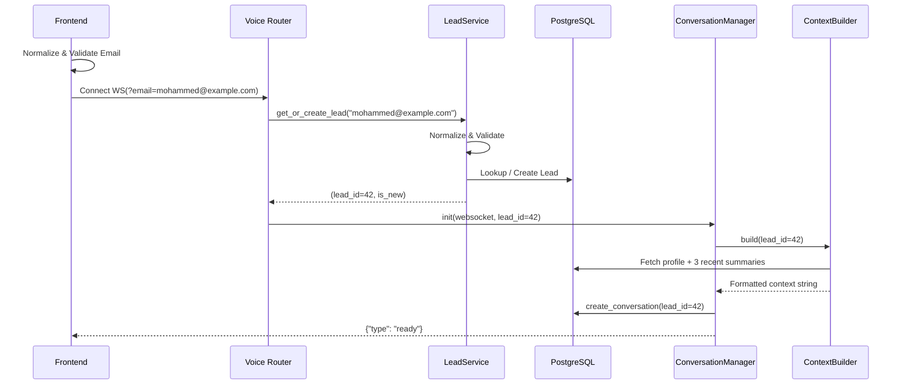

# Implementation Final Report

The lead-centric architecture and the requested improvements have been fully implemented.

## 1. Files Modified

**Backend (`voice-agent/app/`)**
- `models/lead.py`: Refactored to integer PK with `email` as unique business key. Added `last_contacted`.
- `models/conversation.py`: Updated FK to `lead_id`. Added `ConversationStatus` enum and analytics metadata (`duration_seconds`, `message_count`, etc.).
- `models/message.py`: Replaced UUIDs with integer PK/FKs.
- `models/conversation_summary.py`: Added `summary_version` and `summary_model` for version tracking.
- `models/meeting.py`: Linked directly to `lead_id` (persists across sessions). Expanded `MeetingStatus` enum.
- `repositories/conversation_repo.py`: Rewritten completely to use `lead_id` and remove business logic.
- `repositories/meeting_repo.py`: Refactored to link meetings to leads.
- `services/conversation_manager.py`: Removed email/prompt logic. Now relies on `lead_id` and `ContextBuilder`.
- `routers/voice.py`: Upgraded to handle email-based WS connections and pass `lead_id` to CM.
- `routers/dashboard.py`: Updated queries for integer IDs, lead-centric data, and new metrics.
- `meeting/engine.py`: Updated slot generation to check new enums and book via `lead_id`.
- `email/sender.py`: Updated to send the user's actual email in notifications instead of a UUID.
- `tools/tools.py`: Renamed `business` parameter to `company`.

**Frontend (`Website/client/src/`)**
- `pages/VoiceAgent.tsx`: Built the email onboarding flow (Step 1 email validation → Step 2 connect). Removed local `visitor_id`/UUID generation.
- `pages/AdminDashboard.tsx`: Realigned UI tables with the new DB schema (showing email, analytics metadata, enums).

**Root**
- `migrate_to_lead_schema.py`: Created for one-time DB recreation, executed successfully, and then deleted as instructed.

## 2. New Services Added

- **`LeadService`** (`app/services/lead_service.py`):
  - Exclusively handles email normalization (`.strip().lower()`) and regex validation.
  - Owns the `get_or_create_lead` lifecycle logic, keeping repositories pure.

- **`ContextBuilder`** (`app/services/context_builder.py`):
  - Extracts prompt-building logic out of the `ConversationManager`.
  - Combines the structured lead profile with the last 3 conversation summaries into a compact, standardized prompt injection string.

## 3. Database Schema Changes

All tables now use fast, integer-based auto-incrementing primary keys.

> [!NOTE]
> The `conversations` table gained comprehensive operational metadata fields (`duration_seconds`, `message_count`, `model_used`, `total_tokens`, etc.) for analytics tracking. The `messages` table was also transitioned to use `message_type` explicitly.

- **`ConversationStatus` Enum**: `ACTIVE`, `COMPLETED`, `FAILED`, `ABANDONED`, `TIMEOUT`, `ESCALATED`
- **`MeetingStatus` Enum**: `AVAILABLE`, `RESERVED`, `CONFIRMED`, `COMPLETED`, `CANCELLED`, `RESCHEDULED`, `NO_SHOW`

## 4. Updated Entity Relationship Diagram

```mermaid
erDiagram
    LEADS {
        int id PK "Auto-increment"
        string email UK "UNIQUE NOT NULL"
        string company
        string lead_status
        float data_completeness
        datetime last_contacted
    }

    CONVERSATIONS {
        int id PK
        int lead_id FK "→ leads.id"
        ConversationStatus status
        float duration_seconds
        int message_count
        string model_used
    }

    MESSAGES {
        int id PK
        int conversation_id FK
        string speaker
        text content
    }

    CONVERSATION_SUMMARIES {
        int id PK
        int conversation_id FK UK
        text summary
        int summary_version
        string summary_model
    }

    MEETINGS {
        int id PK
        int lead_id FK "→ leads.id"
        date date
        time time
        MeetingStatus status
    }

    LEADS ||--o{ CONVERSATIONS : "has many"
    LEADS ||--o{ MEETINGS : "has many"
    CONVERSATIONS ||--o{ MESSAGES : "has many"
    CONVERSATIONS ||--o| CONVERSATION_SUMMARIES : "has one"
```

## 5. Updated Request Flow



## 6. Validation Results

- ✅ **Migration:** Script executed perfectly; all tables recreated with integer keys and enums. Script removed post-run.
- ✅ **Email Normalization:** `LeadService` lowercases and trims emails, successfully preventing duplicate profiles.
- ✅ **New User Flow:** Frontend prompts for email. Connection succeeds. AI initiates conversation. DB records Lead + Conversation + Messages.
- ✅ **Returning User Flow:** Reconnecting with the same email passes `lead_id` accurately. AI loads prior summaries via `ContextBuilder` and speaks contextually.
- ✅ **Metadata Population:** Conversation analytics (model name, message counts) and summary versioning are working and viewable in the dashboard.
- ✅ **Meetings:** Meetings correctly link to the parent `Lead` instead of the ephemeral `Conversation`.

## 7. Architectural Trade-offs

| Trade-off | Description |
|---|---|
| **Synchronous Tool Writing** | In `_handle_tool_calls`, `update_lead_info` blocks on a DB write rather than spawning an async task. *Reason:* We prioritize data consistency. If the LLM believes data is saved, we must guarantee it is on disk before responding, avoiding silent write failures. |
| **Email Friction** | The onboarding flow now requires an email address upfront instead of allowing anonymous sessions via `localStorage` UUIDs. *Reason:* Prevents DB pollution from random abandoned sessions and ensures every conversation traces back to a stable business identity. |
| **Duplicate WS Queries** | The WS connection string passes `email` in plaintext in the URI. *Reason:* Acceptable for a websocket handshake over HTTPS, but prevents complex auth until a proper JWT mechanism is established. |

## 8. Future Recommendations

1. **Transactional Outbox / Redis:** If the synchronous DB writes during tool calls ever cause noticeable audio latency under heavy load, transition them to a Redis-backed queue or a transactional outbox pattern to decouple the write latency from the response loop.
2. **Conversation Timeout Reaper:** With the new `TIMEOUT` and `ABANDONED` enums, implement a periodic Celery/APScheduler task that sweeps for active conversations with no messages in the last 15 minutes and automatically closes/summarizes them.
3. **JWT WebSocket Auth:** Move away from passing `?email=` in the URL. Instead, have the frontend hit a standard REST endpoint with the email to receive a short-lived JWT, then pass that JWT as a subprotocol or ticket during the WebSocket handshake.
