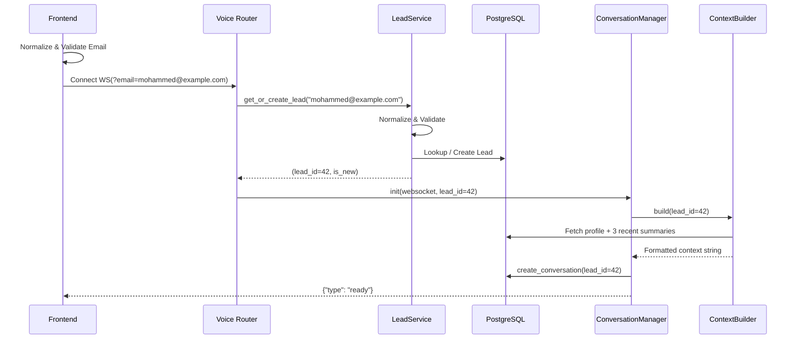

# PP5 Media Solutions - AI Voice Agent

## 1. What the Project is About

This project is a production-quality **AI Voice Agent** integrated into the existing PP5 Media Solutions website. The objective is to create an intelligent system that acts like an experienced business consultant representing the company, rather than a conventional, scripted chatbot. 

It is built with clean architecture and robust engineering practices. The AI is designed to communicate naturally, while a deterministic backend securely handles core business logic, database transactions, and integrations.

---

## 2. What it Does

The AI Voice Agent seamlessly guides users through a comprehensive interaction flow:
- **Lead Identification:** Users authenticate/onboard via their email address before connecting.
- **Consultative Conversation:** Answers questions about the company, understands specific user requirements, and asks intelligent follow-up questions.
- **Lead Qualification:** Evaluates potential clients and securely stores their structured profiles.
- **Meeting Booking:** Allows users to schedule available time slots directly during the conversation.
- **Continuous Context:** Leverages a `ContextBuilder` to remember past conversation summaries for returning leads, giving the AI long-term memory.
- **Conversation Management:** Automatically stores full conversation histories, generates AI-powered summaries, and tracks metadata (duration, message counts).
- **Escalation & Notification:** Escalates conversations when required and triggers email notifications to the company.
- **Analytics & Admin Dashboard:** Provides administrators with a dashboard to view real-time operations, manage meetings, and analyze AI performance.

---

## 3. Skills and Technologies Used

### **Frontend (Website)**
- **Framework:** React 18, Vite, TypeScript
- **Styling & UI:** Tailwind CSS, Radix UI (shadcn/ui accessible components)
- **Animations:** Framer Motion, Tailwind Animate
- **Routing & Forms:** Wouter, React Hook Form, Zod (Schema validation)
- **Data Visualization:** Recharts

### **Backend (Voice Agent API)**
- **Framework:** FastAPI (Python), Uvicorn
- **Real-Time Communication:** WebSockets (handling audio streams and real-time messaging)
- **Database:** PostgreSQL (with asyncpg driver), SQLAlchemy (ORM)
- **AI & LLM Services:** Groq API, LangChain Text Splitters
- **Audio Processing:** Faster-Whisper (Speech-to-Text), Kokoro (Text-to-Speech), Soundfile, Numpy
- **Vector Database (RAG):** Qdrant Client, Sentence-Transformers
- **Security:** Passlib (Bcrypt), Python-JOSE (Cryptography)

---

## 4. Architecture Diagrams

### Entity Relationship Diagram (Lead-Centric Database)

```mermaid
erDiagram
    LEADS {
        int id PK "Auto-increment"
        string email UK "UNIQUE NOT NULL"
        string company
        string lead_status
        float data_completeness
        datetime last_contacted
    }

    CONVERSATIONS {
        int id PK
        int lead_id FK "→ leads.id"
        ConversationStatus status
        float duration_seconds
        int message_count
        string model_used
    }

    MESSAGES {
        int id PK
        int conversation_id FK
        string speaker
        text content
    }

    CONVERSATION_SUMMARIES {
        int id PK
        int conversation_id FK UK
        text summary
        int summary_version
        string summary_model
    }

    MEETINGS {
        int id PK
        int lead_id FK "→ leads.id"
        date date
        time time
        MeetingStatus status
    }

    LEADS ||--o{ CONVERSATIONS : "has many"
    LEADS ||--o{ MEETINGS : "has many"
    CONVERSATIONS ||--o{ MESSAGES : "has many"
    CONVERSATIONS ||--o| CONVERSATION_SUMMARIES : "has one"
```

### System Request Flow


